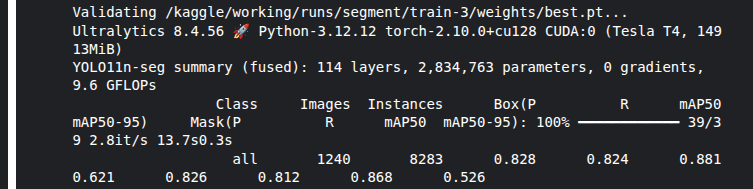
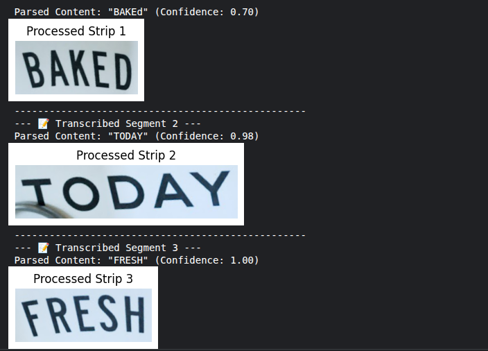

# Custom Hybrid OCR Pipeline: YOLOv11-seg + EasyOCR

A high-performance, end-to-end computer vision pipeline designed to locate, isolate, and transcribe text from multi-type documents. This project leverages a fine-tuned **YOLOv11n-seg** model to accurately detect complex text regions via pixel-level segmentation, applies classical geometry via **OpenCV** to rectify, de-skew, and flatten those regions, and uses **EasyOCR** on the CPU to extract clean text strings.

---

## 🚀 Pipeline Architecture Overview

Text detection models often output skewed or slightly tilted bounding regions. Standard OCR engines read text strictly from left to right on a horizontal plane; passing raw tilted text strips frequently results in low confidence scores or inverted gibberish characters (e.g., "OF" parsed as a mirrored "JO"). 

This project solves that limitation with a hybrid architecture:
1. **Segmentation Layer (AI):** YOLOv11n-seg maps the exact polygon contours of text regions.
2. **Geometric Rectification Layer (Math):** OpenCV extracts the 4-corner minimum area bounding box. Crucially, the coordinates are mathematically sorted (`box.sum()` and `np.diff()`) to enforce a strict layout order: Top-Left, Top-Right, Bottom-Right, and Bottom-Left. This explicitly prevents text strips from being mirrored, inverted, or flipped upside down during the subsequent perspective warp.
3. **Recognition Layer (AI):** The optimized horizontal text strips are converted to grayscale to enhance character contrast and passed to EasyOCR on the CPU for robust linguistic transcription.

---

## 📊 Model Performance & Validation Summary

The segmentation model was fine-tuned on a custom text dataset over a multi-epoch training run. Below is the validation summary evaluated across **1,240 validation images** containing **8,283 individual text instances** on a Tesla T4 GPU baseline environment:

| Metric Type | Precision (P) | Recall (R) | mAP50 | mAP50-95 |
| :--- | :--- | :--- | :--- | :--- |
| **Box (Detection)** | 82.8% (`0.828`) | 82.4% (`0.824`) | 88.1% (`0.881`) | 62.1% (`0.621`) |
| **Mask (Segmentation)** | 82.6% (`0.826`) | 81.2% (`0.812`) | 86.8% (`0.868`) | 52.6% (`0.526`) |

### Model Performance Metrics

### Key Takeaways
* **High Precision (82.6% Mask P):** Ensures highly accurate text boundary targets, minimizing background artifacts or border noise from bleeding into the OCR reader.
* **Strong Structural Fit (86.8% Mask mAP50):** Confirms that the geometric boundaries closely hug the true text shapes, providing excellent source coordinates for the spatial rectification stage.

---

## 📸 Pipeline Walkthrough & Visual Results

### 1. Original Input Document
This is the raw, unprocessed input file containing multi-type layout textures and varying text alignments.

### 2. YOLOv11 Segmentation & Detection
The fine-tuned model evaluates the frame and isolates individual text zones using pixel-level segmentation masks.

### 3. Step-by-Step Rectified Strip Processing & OCR Extraction
Each isolated mask coordinates are passed to our spatial transformer function. The text is isolated, mathematically straightened, stripped of color noise, and transcribed cleanly.
